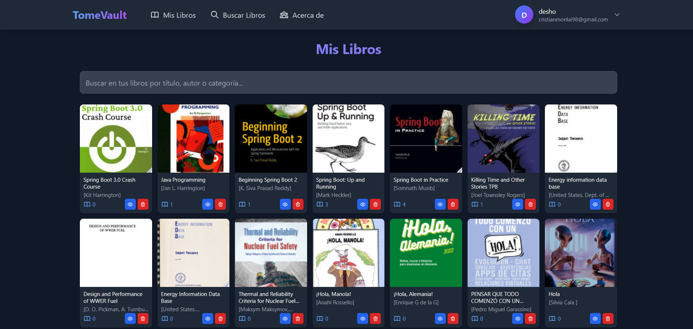
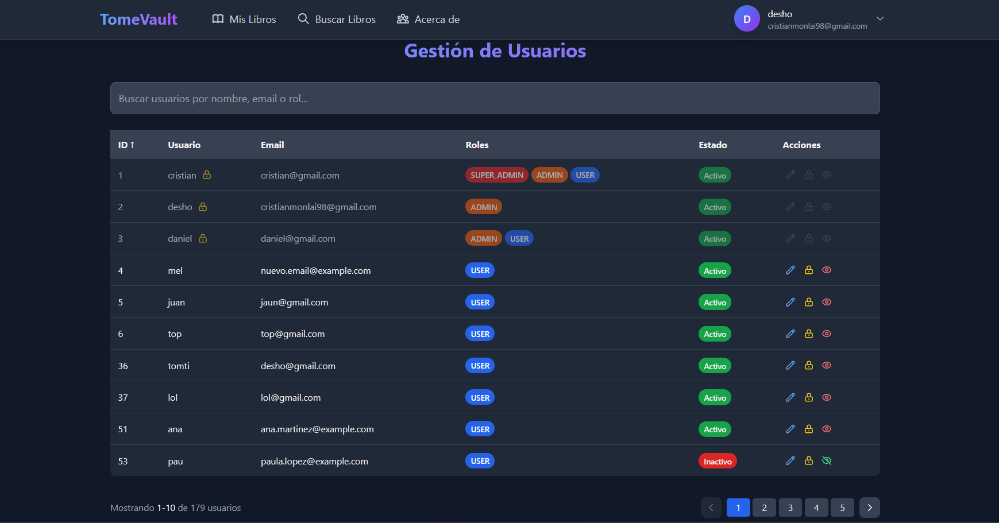

# 📚 TomeVault

> Personal reading tracker to catalog books and count how many times you've read them.

[](https://www.oracle.com/java/)
[](https://spring.io/projects/spring-boot)
[](https://reactjs.org/)

## 📋 Overview

**TomeVault** is a web application that helps you organize your personal library and track how many times you've finished reading each book. Search for books using the Google Books API, save them to your collection, and keep a count of your reading progress.

### Key Features

- 📖 **Reading Counter** - Track how many times you've read each book
- 🔍 **Book Search** - Find books using Google Books API
- 💾 **Personal Library** - Save and organize books in your private collection
- 🔐 **Secure Authentication** - JWT-based login system
- 📊 **Basic Statistics** - See which books you've read the most
- 🎨 **Responsive Design** - Clean interface that works on all devices

## 🖼️ Screenshots

<details>
<summary>Click to expand</summary>

### My Books

*View your personal book collection with reading counts*

### Search Books

*Search and add books using Google Books API*

### Book Details

*Track how many times you've read each book*

### Admin Panel

*Manage users and their permissions (ADMIN role)*

</details>

## 🛠️ Tech Stack

**Backend:**
- Java 21
- Spring Boot 3.4.3
- Spring Security + JWT
- Spring Data JPA
- PostgreSQL

**Frontend:**
- React 18.3.1
- TypeScript
- Tailwind CSS
- Vite

**Deployed on:**
- Backend: Render
- Frontend: Netlify
- Database: Neon (PostgreSQL)

## 🚀 Live Application

The application is deployed and running in production. Anyone can register and start using it - it's a real working app, not just a demo.

🔗 **[Try it now](https://tomevault.netlify.app/)**

**Infrastructure:**
- Frontend hosted on **Netlify** (free tier)
- Backend API on **Render** (free tier)
- PostgreSQL database on **Neon** (free tier)
- Automatic deployment from GitHub on every push

## 📦 Installation

### Prerequisites

- Node.js 18+
- Java 21
- PostgreSQL
- Maven

### Backend Setup

```bash
# Clone repository
git clone https://github.com/srDesho/tomevault.git
cd tomevault/tomevault-api

# Configure application.properties
# Set your database credentials and API keys:
# - PostgreSQL connection
# - Google Books API key
# - JWT secret key

# Run
mvn spring-boot:run
```

API runs on `http://localhost:8080/api/v1`

### Frontend Setup

```bash
# Navigate to frontend
cd ../tomevault-web

# Install dependencies
npm install

# Create .env.development with your API URL
# VITE_API_URL=http://localhost:8080/api/v1

# Run
npm run dev
```

App runs on `http://localhost:5173`

## 📝 Main Endpoints

**Authentication:**
- `POST /login` - User login
- `POST /sign-up` - Register new user

**Books:**
- `GET /books` - Get your book collection
- `GET /books/search-google` - Search books via Google Books API
- `POST /books/from-google/{googleBookId}` - Add book to collection
- `DELETE /books/{id}` - Remove book
- `POST /books/increment-read/{bookId}` - Increase read count
- `POST /books/decrement-read/{bookId}` - Decrease read count

**User:**
- `GET /user` - Get profile
- `PUT /user/update` - Update profile
- `PUT /user/change-password` - Change password

**Admin (ADMIN role):**
- `GET /` - List all users
- `PUT /{id}/roles` - Update user roles
- `DELETE /{id}` - Disable user

## 📁 Project Structure

```
tomevault/
├── docs/
│   └── screenshots/            # Documentation images
├── tomevault-api/              # Spring Boot Backend
│   └── src/main/java/com.cristianml.TomeVault/
│       ├── config/             # Configuration
│       ├── controllers/        # REST endpoints
│       ├── dtos/               # Data Transfer Objects
│       ├── entities/           # JPA entities
│       ├── repositories/       # Data access
│       ├── security/           # Security & JWT
│       └── services/           # Business logic
└── tomevault-web/              # React Frontend
    └── src/
        ├── components/         # React components
        ├── context/            # State management
        ├── pages/              # Page containers
        ├── services/           # API calls
        └── utils/              # Helper functions
```

## 🔑 User Roles

- **USER:** Manage own book collection and reading counts
- **ADMIN:** Manage all users and collections
- **SUPER_ADMIN:** Full system access

## 🎯 Why I Built This

TomeVault started as a personal project to showcase my skills as a Full Stack developer, with focus on backend development using Java and Spring Boot. I wanted a simple way to track my reading progress and see which books I've read multiple times.

## 🔨 Building from Source

```bash
# Clone repository
git clone https://github.com/srDesho/tomevault.git

# Backend
cd tomevault-api
mvn clean package
java -jar target/tomevault-0.0.1-SNAPSHOT.jar

# Frontend
cd ../tomevault-web
npm install
npm run build
npm run preview
```

**Note:** The live application is automatically deployed from GitHub:
- **Render** watches the `main` branch for backend changes
- **Netlify** watches the `main` branch for frontend changes
- Any push to `main` triggers automatic deployment

## ⚠️ Important Notes

- This is a **reading tracker**, not a reading app
- Book information (title, author, cover) is retrieved from Google Books API
- The read counter tracks how many times you've finished a book
- No actual book content is stored or displayed

## 🤝 Contributing

This is a personal portfolio project, but feel free to open issues or submit pull requests.

## 📄 License

This project is licensed under the MIT License - see the [LICENSE](LICENSE) file for details.

## 👤 Author

**Cristian Montaño Laime**
- GitHub: [@srDesho](https://github.com/srDesho)
- Email: cristianmo775@gmail.com
- LinkedIn: [Cristian Montaño Laime](https://https://www.linkedin.com/in/cristianmont/)

## 🙏 Acknowledgments

- Google Books API for book data
- Spring Boot community for excellent documentation
- React and Vite for great frontend tools

---

⭐ **Star this repo** if you find it useful!